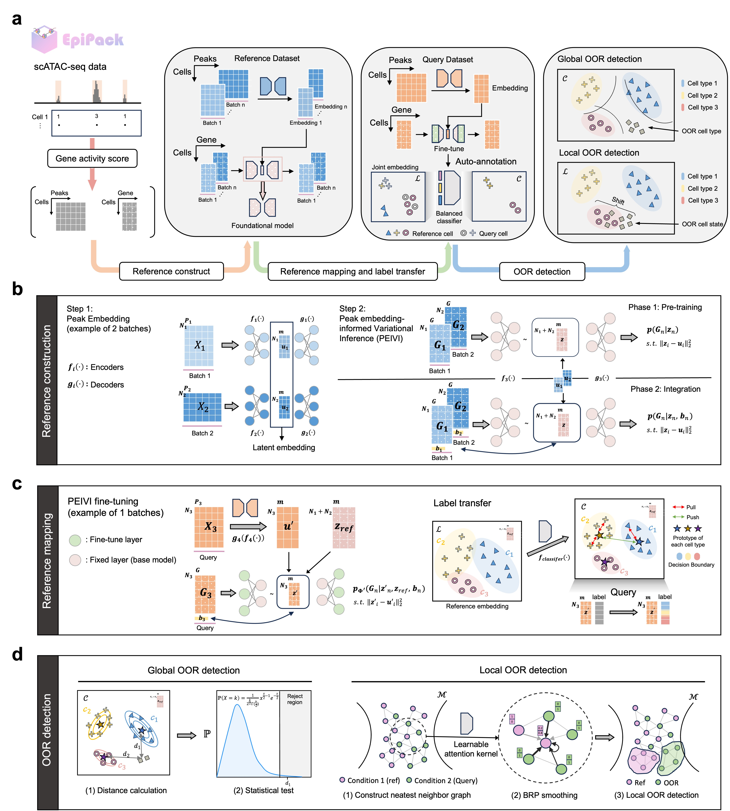

# EpiPack 

---

## Description
EpiPack is a modular deep learning toolkit for **single-cell ATAC-seq reference mapping, cell label annotation, and out-of-reference (OOR) detection**.  
By introducing heterogeneous transfer learning and peak-informed variational inference (PEIVI), EpiPack enables scalable construction of harmonized reference atlases and robust query mapping across diverse scATAC-seq datasets. It further provides **global-local OOR detection frameworks** for discovering novel cell types or perturbed cellular states with interpretable uncertainty estimation. Please see our manuscript for more details.

<p align="center">
  
</p>

---

## Installation
The package is available on **PyPI** and can be installed with all required dependencies via:
```bash
pip install epipackpy
```

---

## Tutorial
Please refer to our full documentation and tutorials at  
👉 [epipack.readthedocs.io](https://epipack.readthedocs.io/)

---

## Dependencies
```
- Python >= 3.9  
- PyTorch >= 2.0.1  
- PyTorch-CUDA >= 11.8  
- NumPy >= 1.26.4  
- Pandas >= 1.5.3  
- SciPy >= 1.10.0  
- Scikit-learn >= 1.5.2  
- tqdm >= 4.66.1  
- Matplotlib >= 3.9.4  
- Seaborn >= 0.12.2  
```
---

For **PyTorch installation**, we recommend users to follow the official [PyTorch installation guide](https://pytorch.org/get-started/locally/) to select the correct build based on their CUDA version.

---
