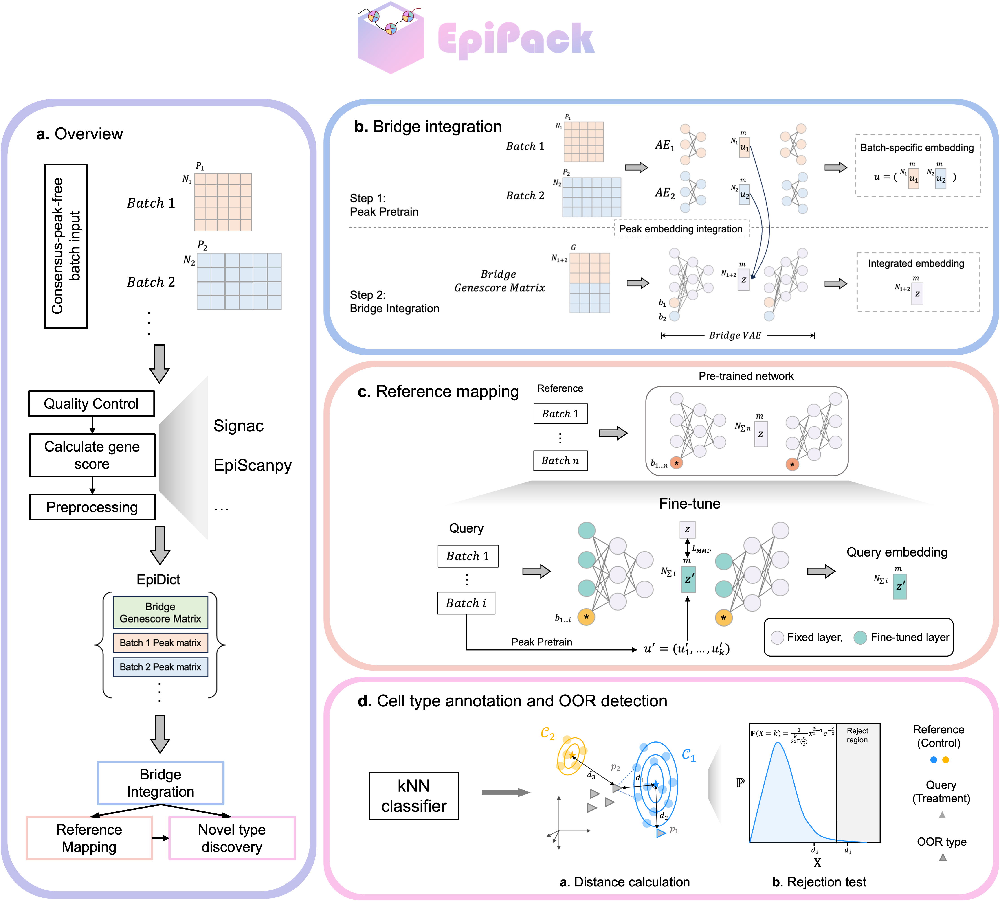

## EpiPack
EpiPack v 0.1.0

### Description
EpiPack is single-cell ATAC-seq atlas construction (integration) and cell type annotation tool. Leveraging its heterogeneous domain adaptation framework, EpiPack is able to
* Integrate multi-source scATAC-seq datasets without aligned peak set
* reference mapping of query datasets
* cell type annotation including OOR detection



### Dependency
```
    python >= 3.8
    pytorch >= 1.11.0
    sklearn >= 0.22.1
    numpy >= 1.21.6
    pandas >= 1.3.5
```

## To-do-list

- [x] Publish to pypi
- [ ] Include our own preprocessing functions
- [ ] Construct a tutorial website for EpiPack
- [ ] Provide pre-trained reference model for all human tissues
